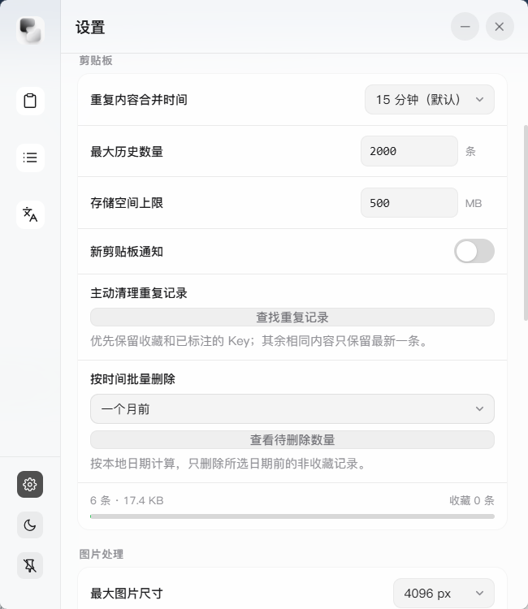
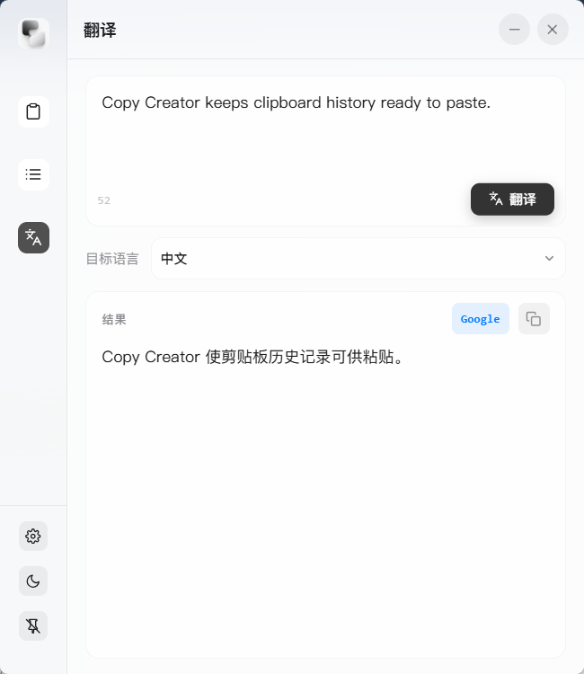

<div align="right">


2026-10-07: Notes, shared save handling and performance improvements are in development. Some native flows and the accounting benchmark are verified; joint acceptance is still pending. See [TODO](docs/TODO.md) and [verification results and limits](docs/verification/2026-10-07-durability-pressure.md).
English | [中文](./README.md)

</div>

<div align="center">


# Copy Creator

**Desktop Productivity Tool for Windows**

Clipboard Manager · Quick Phrases · Translation · Website Vault


</div>

---

## Overview

Copy Creator is a lightweight Windows desktop productivity tool that appears as a floating window and minimizes to the system tray when closed. It combines clipboard history, quick phrases, translation, and encrypted website account information.

## Screenshots

**Clipboard deduplication and cleanup settings**



**Translation example**



## Features

### Updates and About

- About in the sidebar shows the project, installed version, license and repository links.
- Settings → Updates and About share update checks, with an automatic startup check, release notes and a link to download updates from the release page. Downloads are installed manually.

### 📋 Clipboard Manager
- Automatically records text and image copy history
- Keyword search for quick access to historical content
- One-click paste to the current cursor position
- Configurable duplicate window (15 minutes by default), manual deduplication, and date-based bulk deletion with a count preview
- Configurable retention period with automatic cleanup

### ⚡ Quick Phrases
- Organize common phrases and code snippets by scenario groups
- Customizable groups for flexible content organization
- Click to paste directly without manual copying

### 🌐 Translation
- **AI Translation**: Compatible with OpenAI API format, customizable endpoint and model
- **Built-in Translation**: Free translation service, ready to use out of the box
- Local caching of translation results to avoid redundant requests

### 🗝️ Website Vault

- Store multiple accounts per website, including usernames, passwords, registration emails and phone numbers; search by website, URL, account, contact details or tags.
- Generate 12–64 character passwords with selectable character groups and ambiguous-character exclusion; the default length is 24.
- Add personal or work profile templates, arbitrary text fields and sensitive-field masking.
- Record email / SMS verification contacts, recovery codes, security questions, authenticator or passkey locations, and custom verification methods.
- Protect all website data with an independent master password using Argon2id and AES-256-GCM; master password changes re-encrypt records in a transaction.
- Copy or fill individual values. Select the target input, open the app with its shortcut, and click Fill to return and paste. Pin the window for repeated fills.
- Lock after five idle minutes or when the window is hidden or minimized. Private copies bypass this app's history, opt out of Windows history / cloud clipboard, and are cleared after 30 seconds if still owned by the vault.

Available in source; the existing v0.2.24 download does not include this feature. See the [website vault guide](./docs/features/website-vault.md) for storage details.

### 🔒 Local API Key Protection

- Translation and recognized or manually marked clipboard API keys are encrypted with Windows DPAPI for the current user.
- Keys remain available for full-value paste. Settings do not reveal saved translation keys. Exports encrypt settings, favorites, API keys and the complete vault with a separate backup password, supporting cross-device restore, vault merging and legacy JSON imports. See [Encrypted backup and restore](./docs/features/encrypted-backup.md).

### ⚙️ System Features
- Categorized settings with automatic saving, validated input and retry on failure
- Global hotkey to show/hide window
- Window always-on-top display
- Light/Dark theme switching
- Launch at system startup

## Tech Stack

| Layer | Technology |
|:---:|:---|
| Desktop Framework | [Tauri 2.x](https://tauri.app/) (Rust) |
| Frontend Framework | React 19 + TypeScript |
| Build Tool | [Vite](https://vitejs.dev/) |
| UI Styling | Pure CSS (iOS-style frosted glass effect) |
| State Management | [Zustand](https://zustand-demo.pmnd.rs/) |
| Local Storage | SQLite (rusqlite, bundled) |
| Internationalization | react-i18next (Simplified Chinese / English) |

## Download

Download the latest portable build from [this repository's Releases](https://github.com/baihejiangnan/copy-creator/releases/tag/v0.2.24-baihejiangnan.1):

| File | Description |
|:---|:---|
| [Copy-Creator-0.2.24-portable.exe](https://github.com/baihejiangnan/copy-creator/releases/download/v0.2.24-baihejiangnan.1/Copy-Creator-0.2.24-portable.exe) | Portable Windows executable; run without installation |

**System Requirements**: Windows 11

## Usage Guide

### Getting Started

1. **Launch the App**: Double-click the portable EXE; the app appears as a floating window
2. **System Tray**: Closing the window hides it while the app continues running from the tray
3. **Show Window**: Use the global hotkey (configurable in settings) to quickly show/hide the window

### Clipboard Feature

1. Copy any text or image, and the system will automatically record it to clipboard history
2. Click the tray icon or use the hotkey to open the main window
3. Switch to the "Clipboard" tab to browse or search history
4. Click any record to paste it directly to the current cursor position

### Quick Phrases Feature

1. Switch to the "Phrases" tab
2. Click "New Group" to create scenario groups (e.g., customer service scripts, code snippets)
3. Add commonly used phrases to the group
4. When needed, click a phrase to paste it to the current input position

### Translation Feature

1. Switch to the "Translation" tab
2. Enter or paste the text to translate
3. Select translation direction (e.g., Chinese → English)
4. Click the translate button to get results
5. For AI translation, please configure the API endpoint and key in settings

### Website Vault

1. Open “Website Vault” and choose an independent master password of any length, such as 6 characters. Empty or whitespace-only passwords are rejected. Forgotten master passwords cannot be recovered.
2. Add an account, enter its website and account details, and optionally generate a password.
3. Add profile and verification templates or define your own text fields.
4. Search by website or account and open a record to view, copy or fill individual values. To fill, select the target input before opening the app with its shortcut.
5. A copied value remains available for 30 seconds after hiding the window; new reads or copies require unlocking.

Settings backups include all vault records; unlocking a restored vault still requires its master password. Vault images, TOTP code generation, cloud sync and a browser extension that detects form fields are outside the current feature.

### Personalization Settings

- **Hotkeys**: Customize global hotkeys
- **Theme**: Switch between light and dark themes
- **Launch at Startup**: Enable or disable auto-start on boot
- **Storage Management**: Configure clipboard history retention period
- **History Cleanup**: Set the duplicate window, remove duplicates manually, or bulk delete by date

## Development Guide

### Prerequisites

- [Node.js](https://nodejs.org/) (18+ recommended)
- [pnpm](https://pnpm.io/)
- [Rust](https://www.rust-lang.org/)
- [Tauri CLI](https://tauri.app/)

### Local Development

```bash
# Clone the repository
git clone https://github.com/baihejiangnan/copy-creator.git
cd copy-creator/copy-creator

# Install dependencies
pnpm install

# Start development mode
pnpm tauri dev

# Build for production
pnpm tauri build
```

## Project Structure

```
copy-creator/
├── src/                    # Frontend source code
│   ├── components/         # React components
│   ├── pages/              # Page components
│   ├── stores/             # Zustand state management
│   ├── styles/             # CSS style files
│   ├── i18n/               # Internationalization config
│   └── types/              # TypeScript type definitions
├── src-tauri/              # Tauri backend source code
│   ├── src/                # Rust source code
│   └── Cargo.toml          # Rust dependency config
├── public/                 # Static assets
├── assets-source/          # Original assets retained outside release output
└── package.json            # Frontend dependency config
```

## Agent Collaboration

Agents should start with the root [AGENTS.md](AGENTS.md), which covers the project overview, code entry points, documentation paths, development constraints and validation commands.

## License

This project is licensed under the MIT License.

---

<div align="center">

If you find this project helpful, feel free to give it a Star!

</div>
