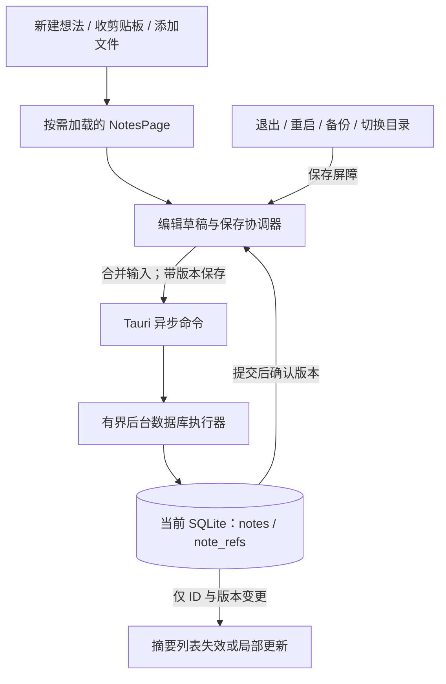

# 便签：功能设计与接入方案

收尾补充：O-01 基线与 O-02 字体集合验收已收回；连续粘贴补查获得外部剪贴板占用证据，默认已加入有界等待、焦点/序列校验与失败可见提示；最终连续 20 次复验第 17 次仍空，整体粘贴验收未通过，保留外部目标无确认协议的边界。最终 Release 46,393,856 字节，NSIS/MSI 32.19/33.94 MB；20MB 按用户指示为尽力参考。详见[粘贴等待与失败提示收尾](../verification/2026-10-08-closeout.md#粘贴等待与失败提示收尾)，整体状态以 TODO 为准。

首次 ready 前真实托盘退出已在最新默认通过：根节点尚空时不提前退出，恢复脚本/首次交接后实际结束。S-01 及其 N-03/N-06 依赖验收收回；新原生进程自动检查关/开为 0/1、关于 UI/焦点和最终静态依赖图补齐 O-07，详见[归并与边界](../verification/2026-10-08-closeout.md#首次-ready-与依赖验收收回)。

后继默认 Release 修复隐藏主窗缩略图占位动画仍转：同图片驱动约 30 秒单核 CPU 18.418→0.574%，双窗持续 110 图片、缓存/并发与隐藏停止通过，O-03 收回；O-04 真实查询 IPC 100→1 和插入期间分页无漏重已收回。EXE 仍为 46,369,280 字节，JS 增 51 字节，字体/CSS/原生摘要保持；全树内存未达标，不宣称内存下降。见[新默认证据](../verification/2026-10-07-images-query-entry.md#默认动画修复复验)。

滚动条主题修复、满容量/只读回归、异常结束后的同 EXE 原生重开及旧托盘命令跨迁移已补验；前端 74/74、Rust 137 通过/3 忽略、类型/完整 lint/生产构建通过。整小时核心及失败恢复分开记录；核对已有源码/报告后 S-01～S-04、N-03/N-06、O-03/O-04/O-05/O-06/O-07/O-09 验收已收回。最新 NSIS/MSI 为 32.19/33.94 MB；用户明确接受体积尽力优化，20MB 作为参考目标、不再作为收尾门槛。当前版补完 30 次启动观察和常用页/显隐采样，包含显式显示控制，不与旧轮直接计算启动收益。200% 实际缩放、剩余旧功能/故障矩阵及严格同方法运行比较仍待补；全进程树内存约 494/490MB，80MB 未达标。完整范围见[本轮收尾](../verification/2026-10-08-closeout.md)，状态以 [TODO](../TODO.md) 为准，未公开发布。


2026-10-07：便签页面和共享优化持续实施。前端 38 项、Rust 含 diagnostics 120 项通过，2 个 Release 基准默认忽略；类型、完整 lint 和生产构建通过。连接采用 WAL/FULL；默认 Release 的 256 KiB 单段输入卡顿已修复，按键到 Paint P95 10.960ms，无 >50ms 长任务。原生保存/整理/恢复、确认丢失重试、冲突副本及最小窗已部分验收；真实 IME 与其他联合验收继续，详见[最新证据](../verification/2026-10-07-durability-pressure.md)。
首次评估：2026-10-06。设计更新：2026-10-07。状态：**实施中；数据层与便签页面已接入，桌面联合验收待做**。

后续拆为两个主任务：N「便签」与 O「合理优化性能与体积」。本文件维护便签定位、交互、数据与可靠性合同；共享热点、资源和发布实验详见 [性能与体积优化方案](performance-design.md)。实施状态与待验证项统一维护在 [TODO](../TODO.md)，共用 S 项只交付一次。

实际缩放已补 100%/125%/150% 最小窗的中英文、亮暗、编辑/列表/卡片菜单共 36 组合，原生缩放与 DPR 一致，无模拟 zoom；系统恢复原 125%，剪贴板恢复校验。显示设置最高仅提供 175%，200% 未执行，完整验收仍未收齐，详见[支持矩阵](../verification/2026-10-08-controlled-desktop.md#实际-windows-缩放支持矩阵补验)。旧搜索 QA 的遗留实例已确认保存后关闭，后续入口增加全测试根目录实时进程准入，历史隔离限制见[实例补查](../verification/2026-10-08-autostart-isolation.md#遗留实例补查与实时进程准入)。

### 2026-10-07 实施进展

[notes.rs](../../copy-creator/src-tauri/src/notes.rs) 已实现独立表、摘要游标分页、全文读取、创建/保存幂等、revision CAS、来源快照及归档/软删除/恢复；普通剪贴板捕获读原始全文，拒绝受保护 Key、图片和不明确的路径。正文保留空白，统一校验 256 KiB 正文、128 字标题及 20 个引用上限。14 项便签单元测试和 6 项连接/迁移/清理隔离测试通过；证据见[首批验证记录](../verification/2026-10-07-notes-foundation.md)。

启动和目标库共用版本迁移/连接配置；便签命令使用有界后台执行并核对 `storage_epoch`。第二批已接入前端保存核心及统一原生交接，23 项前端测试通过，见[保存交接验证](../verification/2026-10-07-save-handoff.md)。第三批已接入 v3 备份、冲突副本/独立去重、容量边界及联合搬迁，schema 3 新增 `note_import_origins`；全量 Rust 108/108 通过，见[第三批验证](../verification/2026-10-07-backup-relocation.md)。原生文件命令与侧栏页面已接入，桌面/Release 验收继续进行。联合搬迁已替换临时保护，普通目标有便签/密码箱仍拒绝覆盖；仅允许校验通过的本次暂存凭据重试。

字体发布集合已经实际调整：37 个未引用字体保留在 `assets-source/fonts/`，现用 5 个仍在 public。R0/R1 的生产前端从 97,489,964 减到 45,974,752 字节，保留产物与全部原字体哈希不变；这不代表已完成桌面视觉、EXE/安装包或运行性能验收。以下 §2 保留首次评审的历史口径，最新证据见[优化方案 §2.4](performance-design.md#24-2026-10-07-实际发布集合调整)。

首次评估对象是工作区源码（HEAD `2fca698` 加原有未提交改动），包括网站资料、加密备份、更新检查、关于和设置调整；当时未启动桌面应用。后续已用独立 QA 标识、合成数据和真实 WebView/SQLite 验证部分流程，没有读取生产用户数据库，也没有用已发布 v0.2.24 安装包替代源码产物。下文评审阶段的源码结论与预算保留历史口径，当前实测以验证记录为准。

## 1. 结论与产品定位

建议加入便签，但应把它做成 **主动收集、稍后回看的本地收件箱**。它适合补上目前产品的一处缺口：剪贴板记录“刚才复制过什么”，短语保存“反复要用什么”，便签保存“现在不处理，但不想忘记什么”。

最佳接法是：**独立侧栏入口、独立便签数据、复用主窗口与 SQLite、纯文本编辑、文件只存引用、页面按需加载**。这能让便签与现有功能协作，同时保持简单的运行结构。

真正的开发重点应该是保存可靠性、数据生命周期和共享性能路径。直接添加列表、编辑框和 CRUD，会继承当前的退出、查询和存储切换风险，也不能解决长期使用后的开销。共用保存、迁移和存储身份必须补齐；字体精简、轮盘图片、现有容量统计和分包独立交付，只有实测影响便签预算的热点才成为首发阻塞项，不要求先完成全应用重构。

**本轮补充的明确约束：界面美化、字体美化和现有功能都是交付要求。** 优化聚焦未使用的发布资源、重复计算、无效请求和过早加载。字体首选保留当前字体及字重，优化分发格式；不默认换成系统字体。现有透明层次、圆角、阴影、图标、主题、图片预览、动画反馈以及已实现功能都纳入回归验收。

| 内容 | 合并后的决策 |
| --- | --- |
| 当前使用的 4 个 PingFang 字重和品牌字体 | 保留字体、完整字符覆盖及排版，评估 WOFF2 压缩 |
| 未使用的 37 个字体文件 | 从客户端发布集合移出，源资产可保留在构建范围之外 |
| 毛玻璃、阴影、卡片、动画和主题 | 保留视觉设计，减少离屏计算、重复图层和无效动画触发 |
| 剪贴板、短语、翻译、密码箱、备份、托盘、轮盘、更新检查等已有功能 | 保留行为与入口，采用按需加载和后台执行优化实现 |
| 图片缓存、历史容量统计、列表查询 | 改造热点算法，与便签共用必要基础设施 |
| 富文本、图片附件、同步等新增扩展 | 按便签需求单独评估，不作为替代现有功能或拖延首发的理由 |

| 方案 | 价值与成本 | 判断 |
| --- | --- | --- |
| 扩展剪贴板收藏备注 | 改动少，但无法独立写想法，备注依附记录，受历史操作语义约束 | 不作为主方案 |
| 给剪贴板增加 `note` 类型 | 看起来能复用列表，但去重、容量淘汰、粘贴与主动编辑混在一起 | 不推荐 |
| 独立便签模块，共享窗口和数据库 | 生命周期清楚，复用基础设施，新增常驻成本容易控制 | **推荐** |
| 新建常驻便签窗口和独立数据库 | 快速捕获可独立，但增加 WebView、通信、备份和迁移成本 | 现阶段没有足够收益证据 |
| 富文本、提醒、任务、附件与同步一起加入 | 扩大定位，也扩大依赖、渲染、索引和冲突处理成本 | 暂缓 |

假设首版以本地单用户使用为主，记录想法、文字摘录和本地文件位置，不要求多人协作、云同步或任务提醒。若这些前提改变，应重新评估数据和交互边界。

## 2. 当前应用的真实基线

### 2.1 已核验的结构与体积

| 项目 | 当前事实 | 含义 |
| --- | --- | --- |
| 技术栈 | React 19、Zustand 5、Tauri 2、rusqlite 0.31 | 加便签无需换框架或引入新路由库 |
| 窗口 | 主窗口之外，启动时还创建一个隐藏的径向菜单 WebView | 现有架构文档的“单窗口”描述不能作为新增窗口的成本依据 |
| 页面 | 全部页面静态导入，但只挂载当前活动页 | 不是所有页面都常驻渲染；模块加载和页面挂载是两件事 |
| 数据库 | 一个 `Mutex<Connection>`；启动配置 WAL、`synchronous=NORMAL` | 读写、统计和保存共享锁，需要关注锁等待与持有时间 |
| 最新评审构建 JS | `507,283` 字节；gzip `151,690` 字节 | 一个主 JS，存在按入口和页面拆分的空间 |
| 最新评审构建 CSS | `83,285` 字节；gzip `13,843` 字节 | 页面样式全部进入一个 CSS |
| 最新前端发布内容核算 | 50 个文件，`97,489,964` 字节，即 `97.49 MB` | 内存生产构建输出加 public 清点，不是安装包或进程内存 |
| 字体资源 | 42 个文件，`95,937,408` 字节，即 `95.94 MB` | 发布资源优化空间比新增简单编辑器的体积更大 |
| 已找到 CSS 引用的字体 | 5 个，`44,422,196` 字节，即 `44.42 MB` | 保留使用的字体，进一步评估分发格式压缩 |
| 未发现源码引用的字体 | 37 个，`51,515,212` 字节，即 `51.52 MB` | 从发布资源中排除后，可减少相应未压缩体积；安装包减少量需另测 |

体积使用十进制：1 MB = 1,000,000 字节，1 KB = 1,000 字节。最新数据来自 2026-10-06 评审的 Vite `build({ build: { write: false } })` 内存生产构建与 public 清点；该评审没有重新执行 TypeScript 检查、Rust Release 打包或桌面测试。此前 97,477,370 字节、495,687 字节 JS 的隔离快照完成过生产构建与 TypeScript 检查，不能混写成同一结果。下一次以完整源码快照或工作区差异固定基线；详细口径见 [优化方案 §2](performance-design.md)。

此前隔离构建使用的命令如下，工作目录为仓库内 `copy-creator/`。最新评审使用内存生产构建 API，没有写出另一份隔离目录：

```powershell
node ./node_modules/typescript/bin/tsc -b
node ./node_modules/vite/bin/vite.js build --outDir node_modules/.cache/notes-assessment-build-20261006
```

源码依据：[入口](../../copy-creator/src/main.tsx)、[页面注册与切换](../../copy-creator/src/App.tsx)、[窗口创建和启动顺序](../../copy-creator/src-tauri/src/lib.rs)、[数据库](../../copy-creator/src-tauri/src/db.rs)、[字体定义](../../copy-creator/src/styles/base.css)。

字体放在 `public/`，会随构建原样复制，并不因无引用而被自动去掉；这符合 [Vite 的 public 资源规则](https://vite.dev/guide/assets.html)。字体文件总量也不代表全部字体会同时加载到内存。

### 2.2 保留视觉资源的体积实验

此前 2026-10-06 的隔离快照做了两个生产前端输出：完整 public 资源，以及只保留 CSS 引用的 5 个字体、同时保留其余 public 图片/图标资源。下表保留该实验的真实数字，不替换成最新快照的推算值。实验没有改业务源码、应用原有 `dist` 或字体源文件，也没有进行字体转换。

| 指标 | 完整资源输出 | 精简发布集合输出 |
| --- | --- | --- |
| 前端目录 | `97,477,370` 字节（97.48 MB） | `45,962,158` 字节（45.96 MB） |
| 文件数量 | 50 | 13 |
| 字体文件数量 | 42 | 5 |
| 字体资源体积 | 95.94 MB | 44.42 MB |
| 减少量 | — | **51,515,212 字节（51.52 MB）** |
| 保留资源校验 | 基线 | JS、CSS、HTML、字体、图片和图标逐文件 SHA-256 均与基线相同 |

这证明只调整发布集合就有明确瘦身收益，且不需要改动当前使用的视觉资源。它还不是正式发布包：真实 EXE、字体实际渲染、WebView2 内存和运行延迟仍需按后文验收。

### 2.3 已有优化，应该保留

主剪贴板已经有 120 条分页、300ms 搜索防抖、卡片 `memo`、选择性 Zustand 订阅、主列表图片可视范围加载、缩略图请求并发上限 3、缩略图 80 条缓存、完整预览 4 条缓存，以及 264px 缩略图和 1600px 预览尺寸限制。完整预览 `getImageData` 没有走缩略图限流队列；各 WebView 队列独立，也不能用主列表的可见性优化代表隐藏轮盘。具体路径和新验收见 [优化方案 §4](performance-design.md)。

这些措施不能被算作本次新提出的优化。`content-visibility` 主要减少布局与绘制，不等于减少 React 组件、订阅或图片内存。Windows 剪贴板虽以 800ms 轮询，但已经先检查序列号；没有变化时跳过读取，不能仅凭轮询就认定空闲 CPU 很高。

依据：[clipboardStore.ts](../../copy-creator/src/stores/clipboardStore.ts)、[剪贴板页面](../../copy-creator/src/pages/ClipboardPage/index.tsx)、[ImageThumb.tsx](../../copy-creator/src/pages/ClipboardPage/ImageThumb.tsx)、[components.css](../../copy-creator/src/styles/components.css)、[clipboard.rs](../../copy-creator/src-tauri/src/clipboard.rs)。

### 2.4 尚未测量的内容

本次没有测得冷启动时长、空闲 CPU、进程内存、输入延迟、数据库尾延迟或新增便签后的增量成本。因此不提供“快了多少百分比”“只增加多少 MB 内存”等结论。构建通过也不证明跨应用快捷捕获或桌面保存交接可靠。

[现有 PRD](../specs/PRD.md) 的冷启动 <2s、常驻内存 <80MB 仍是整体要求；包体积 <20MB 已由用户明确调整为尽力优化的参考目标，未达到不阻塞收尾，仍报告真实打包结果与取舍；这些数值不是已达成的基线，便签的增量预算不能替代这些整体目标。剪贴板已采用 Windows 事件唤醒并保留 800ms watchdog；完整默认 Release 的 60 次普通文本记录 P95 36ms、最大 87ms，不能代替图片/文件及持续系统压力下的 <100ms 保证，见[事件监听实测](../verification/2026-10-08-clipboard-events.md)。字体未压缩体积与安装包压缩体积口径不同，最终包体积仍需真实打包核验。

## 3. 与性能、体积优化任务的接入关系

便签与优化拆成两个可独立交付的主任务，统一进度见 [TODO](../TODO.md)，优化细节见 [性能与体积优化方案](performance-design.md)。此前本节的共享热点、字体、美化与分包建议已移入优化方案，仍保留全部约束。

| 内容 | 便签首发要求 | 对应任务 |
| --- | --- | --- |
| 保存交接、连接配置与版本迁移、存储身份 | 必须具备；退出/重启/备份/搬迁失败不能吞稿或混库 | S-01～S-03 |
| 后台执行和查询控制 | 便签新命令有界执行、保存不被无效查询淹没；旧模块逐项迁移 | S-04、N-01/N-03/N-04 |
| 字体、美化、预览与已有功能 | 始终保留；首发做视觉和功能回归 | N-02/N-07、O-02/O-10 |
| 主列表/轮盘图片、增量容量统计、入口分包、原生发布实验 | 独立优化；实测影响便签预算时再列为阻塞，不等待全部重构 | O-03～O-08 |
| 备份容量预检与有界读取/序列化 | 纳入便签备份的必要集成；正常和超限路径均有界 | N-05、O-06 |
| FTS、虚拟列表、读连接池等 | 仅在数据规模和测量证明收益后引入 | O-09 |

共用 S 项由先实施的任务交付并提供验收证据，另一任务复用。便签保存、数据安全与生命周期合同是硬门槛；发布资源精简和具体热点修复可以独立推进，不能把所有优化都变成便签的无限期前置。

## 4. 便签交互：随手收下，再有序回看

### 4.1 入口与布局

侧栏新增“便签”，默认位于剪贴板之后。便签复用当前设计 token、字体、卡片材质、图标线条和主题，保持整套应用的视觉一致；编辑区域使用足够正文行高与清楚的保存状态，不把纯文本存储等同于简陋界面。主窗当前 520×600、最小 440×420；默认使用单栏“列表 → 编辑”，返回时恢复列表位置和搜索条件。宽窗双栏可在后续验证后增加。新增第五项导航后，应验证最小高度和显示缩放；导航中段允许滚动，底部设置等操作仍可触达。

```text
便签                               ＋ 新建
[ 搜索便签                           ]
  未归档       已归档

改一下登录页的空状态
周末想到的文案，别打断现在的修改……
今天 10:24                 文件 1

一段值得保留的表达
“让用户先完成眼前的事……”
昨天                       来自剪贴板
```

```text
← 便签                      保存中 / 已保存
[ 标题，可不填写                         ]
[ 正文，打开后直接获得输入焦点            ]
[                                       ]
引用：login.tsx     [所在位置] [复制路径]

添加文件 / 添加链接       复制正文   归档
```

标题可留空，显示标题由正文第一个非空行或首个引用名称生成。正文保留用户的空格和换行，不采用短语当前的全文 `trim()` 行为。空标题、纯文本和引用不要求先分组。

### 4.2 三种主要捕获方式

| 场景 | 动作 | 保存语义 |
| --- | --- | --- |
| 冒出一个想法 | 点“新建”，直接输入；窗口内可用 Ctrl+N | 首次有正文或引用时才创建记录，空白草稿不堆积 |
| 看到一段话 | 剪贴板卡片菜单“收为便签” | 后端按记录 ID 读取全文，创建独立快照，不能用列表截断预览 |
| 稍后要改文件 | 选择文件，或后续支持拖入 | 保存路径、展示名和备注，不复制文件或读取全文 |

“收为便签”的快捷操作可以先保存，再用轻提示提供“补充备注”；不强迫离开当前剪贴板页面。相同用户动作重试不重复创建；用户再次主动收相同文字可以产生第二条，不能套用剪贴板自动去重规则。

来源可以附上时间、原应用名称、原网址或原文件位置，保存捕获时的快照。剪贴板 ID 仅作为溯源提示，删除原记录不影响便签。来源网址只使用已有来源信息，不凭文本推断原网页，也不抓取网页补全。

捕获接口按类型处理：`text` 保存完整正文，`link` 保存原文并可增加 URL 引用，`file` 保存结构化路径引用，`explorer` 仅在已取得明确路径时转引用。`image` 首版不支持，受保护 API Key 拒绝普通捕获；界面给出对应状态，不能把图片路径或密文当作普通正文。

这里的完整正文是后端历史记录中已存的全文，不是被截断的卡片预览。现有系统采集在普通文本入库前去除首尾空白，表格文本另保留布局；便签捕获不能恢复采集阶段已去掉的字符。便签新建/编辑、已有历史全文及备份恢复继续原样保留空格和换行，不能再做 trim。受控系统剪贴板验收明确比较采集前、历史记录和便签三个阶段，不把此边界写成便签原文丢失或声称逐字保留 OS 原始来源。

### 4.3 快捷捕获

全局“新建便签”快捷键是推荐的增强入口，但排在保存可靠性之后。先支持页内创建和剪贴板收集；在动作路由、注册失败处理及桌面验证完成后，再开放可配置全局快捷键。

复用主窗口中的快速输入模式，不新建常驻 WebView。按键动作是“显示、进入快速捕获、聚焦草稿”。有尚未完成的快速捕获会话时复用它；正在编辑既有便签时，先排队保存并保留原稿，再开始新的捕获草稿。连续按键只是聚焦，不重复建记录、不清空正文，也不把新想法追加到旧便签。

快速捕获提供“完成”（Ctrl+Enter）：提交成功后结束该会话，下次快捷键开始下一条；失败则保留当前会话。隐藏窗口不结束会话。若前端还没准备好，后端保留待处理动作，前端 ready 后取走；不能仅发送一个可能丢失的瞬时事件。

默认不模拟 Ctrl+C 抓取其他应用的选区，也不默默把当前剪贴板灌入正文。用户明确选择“收当前剪贴板”时才读取内容。注册新快捷键成功后再撤旧键，冲突时保留原键和配置。

### 4.4 整理与文件引用

默认显示未归档内容。归档表示从眼前收起，支持恢复，不表示任务完成。删除必须可撤销，晚到的自动保存不能复活已删除记录；首版可采用软删除，在“更多”菜单提供“最近删除”及恢复入口。具体保留期建议 7 天并在界面明确说明，到期清理放在现有后台维护路径。切换存储目录携带未过期删除项，避免恢复能力随换目录消失。

点击便签进入编辑。复制正文是独立操作，不沿用剪贴板“点击即粘贴”；普通便签不设置密码箱的定时清空语义。

文件引用首版提供“打开所在位置”“复制路径”和“重新定位”。列表不对每个路径执行 `exists()`，也不扫描目录、监控文件或生成缩略图；用户明确操作时才检查，网络路径检查放后台并提供失败/取消状态。Windows 多文件路径从原生 CF_HDROP 或文件选择器读取，不靠显示文本猜测。

引用失效时保留便签并提示重选；删除便签只删除引用数据，永远不删除外部文件。导入到另一台机器的路径可能失效，但正文仍可阅读。

## 5. 数据、状态与接入边界

### 5.1 推荐架构



新增 `pages/NotesPage/`、`stores/noteStore.ts`、`types/note.ts`、`styles/notes.css` 和 Rust `notes.rs`。复用主题、搜索控件、图标及数据库基础设施；业务状态独立于剪贴板 store。

编辑器可以持有输入状态，但有效草稿必须同步到页面之外的协调器。协调器首次使用便签后才激活，生命周期属于主 WebView，而不是 `NotesPage`。切页卸载不会取消保存。不要把每个输入字符放进全列表订阅，也不要用浏览器 localStorage 再维护一份正文。

编辑器只订阅当前草稿与必要保存状态；摘要、全文 UTF-8 字节数和请求摘要集中在合并保存/校验阶段计算，不在每次键入时重算整个列表。超限校验保留准确性，避免每键复制/编码大正文；256 KiB 输入、粘贴与 IME 延迟需要实际检查。具体调度算法以测量确定，不能因纯文本编辑器就假定输入已达预算。

当前实现使用惰性加载的 CodeMirror 纯文本状态与视口绘制，依据真实 textarea 单长段布局瓶颈采用；保留软换行、字体、拼写检查、完整正文及撤销重做，不引入语法解析或富文本。LF 分隔配置保留已存原文的 CRLF/单独 CR。编辑器接收失败时恢复协调器已接受文本并显示错误；UTF-8 超限稿可保留并修正，不能静默裁切。该选择增加惰性 JS，体积和输入对照见最新验证记录，真实 IME 不由 CDP 键盘测试替代。

### 5.2 数据模型

| 对象 | 关键字段 | 约束 |
| --- | --- | --- |
| `notes` | UUID、可选自定标题、正文、派生摘要、字符数/字节数、创建/更新时间、revision、归档/删除时间、唯一且不可变的 creation mutation ID、最后 save mutation ID/请求摘要 | 普通便签独立保存，不进入剪贴板 TTL、容量淘汰或清理逻辑 |
| `note_refs` | UUID、note_id、类型 file/url、target、display_name、排序位置 | 不保存外部文件正文；同便签事务增删 |
| 来源快照 | 来源种类、可选原记录 ID、原应用、原网址和捕获时间 | 非强外键依赖，不妨碍原历史清理 |

建议默认上限：正文 256 KiB（UTF-8）、自定标题 128 个 Unicode 字符、单条引用 20 个、列表摘要 160 个 Unicode 字符。它们是控制极端输入成本的初始参数；超限必须提示，不能静默截断正文。读取、导入和拖入也使用同一约束。

保存时计算摘要和长度。列表 SELECT 不取 `body`，全文仅在打开编辑时读取；这主要减少字符串处理和 IPC，不等于承诺 SQLite 物理读零正文页。若长文夹具证明仍有页读取压力，再考虑正文拆表。

索引围绕实际过滤和排序建立：未归档和已归档分别使用按 `(updated_at_ms DESC,id DESC)` 排序的部分索引，条件为 `deleted_at_ms IS NULL AND archived_at_ms IS NULL` / `IS NOT NULL`；“最近删除”另按删除时间查询。用 EXPLAIN 验证对应 SQL，不能假定归档时间范围条件后的组合索引还能直接提供更新时间排序。时间由后端统一生成，排序再加 ID 消除并列的不确定性；版本号而非时间戳用于保存冲突判断。

### 5.3 接口合同

下表省略共同参数 `expected_storage_epoch`；所有读取、写入及引用操作均校验目标存储身份，响应和事件绑定实际 epoch。首次激活从后端获取当前身份，切换后重新同步；不能用前端本地计数替代后端校验。

| 命令 | 返回与行为 |
| --- | --- |
| `list_notes(filter, search, cursor, limit)` | 每页默认 50、最多 100；只返回摘要、状态、引用数量、版本及 next_cursor |
| `get_note(id)` | 正文、引用、来源和 revision |
| `create_note(id, mutation_id, draft)` | 客户端稳定 UUID；重试幂等，正文与引用一起提交 |
| `save_note(id, expected_revision, mutation_id, draft)` | CAS 更新；不匹配时返回结构化冲突，保留本地草稿 |
| `set_note_state(id, expected_revision, mutation_id, action)` | 已实现；action 为 archive/unarchive/delete/restore，带预期版本，与此条便签的待保存操作保持顺序 |
| `capture_clipboard_as_note(record_id, mutation_id)` | 后端读取完整普通内容并创建快照，不需要前端先取正文再传回 |
| `reveal_note_ref(ref_id)` | 待 N-02 接入；原生打开所在位置，校验已保存引用；不执行任意命令字符串 |

同一 mutation ID 绑定同一不可变请求；后端比较该请求或摘要，不能把相同 ID、不同内容当作重试。创建/捕获使用持久化且唯一的 `creation_mutation_id`，之后编辑不会覆盖它，迟到重试仍定位原便签；删除后在保留期内也不能因此重建。

当前数据层读取、写入统一返回 `{ storage_epoch, value }`；变更命令的 value 为 `{ note, mutation_id, applied }`，幂等重放 `applied=false`。错误为 `{ code, current_revision? }`。`get_storage_epoch` 提供初始身份；Tauri 前端调用的共同参数名为 `expectedStorageEpoch`。捕获以 mutation UUID 作为稳定 note ID，同一动作在原剪贴板记录已删除后仍能重试确认；新的主动动作使用新的 mutation UUID，可以另建一条。

保存与状态变更使用 `last_mutation_id + last_mutation_hash`，确认响应不明的当前提交后才继续发送下一版。提交成功但响应丢失时可以重试确认；更旧的保存重试返回“已被后续版本取代”或冲突，不覆盖新 revision。这个最小方案不承诺确认任意历史请求；若以后要求跨硬删除确认所有历史请求，再增加有界 mutation ledger。

保存正文、引用、摘要、字节统计与 revision 使用一个短事务。提交成功之后才发送 `notes-changed { id, revision, mutation_id, change_kind }`；事件不带全文。

查询按 `(updated_at_ms,id)` 游标分页，追加按 ID 去重。编辑改变排序时，使相关分页代次失效或局部更新，不假设游标提供跨多次编辑的永久快照。搜索响应同样需要查询代次校验；失效查询尽可能取消或合并，不能只在前端丢结果却让后台无界积压。

查询代次同时绑定后端 `storage_epoch`。读/写请求带预期存储身份，响应、变更事件和正文缓存携带或校验该身份；后台任务执行前和提交时复核，旧库事件/响应不能写入新库状态。目录切换成功后提升 epoch、清除干净缓存并重新加载，未保存草稿先按保存屏障处理。仅有 `queryKey + generation` 无法区分相同条件下的不同数据库。

## 6. 自动保存：首先保证可理解、可恢复

### 6.1 保存流程

1. 输入立即更新草稿，字符显示不等数据库或 IPC。
2. 初始参数为 500ms 空闲触发、连续输入最长 2s 触发；IME 组合输入期间不提交半成品，结束后保存。
   新建草稿仅有标题时不创建 DB 记录，但保留恢复资格与额度；退出、导入或切换目录必须提示补正文/引用或明确放弃，不能将它当作已经落库的干净缓存清除。
3. 每条便签最多一个保存请求在途，后续输入只替换“最新待写快照”。用户输入的草稿序号与数据库 revision 分开管理。
4. 后端按预期 revision 更新，成功返回新 revision 和 mutation ID。
5. 仅当确认对应当前草稿序号，且没有更新输入时显示“已保存”。旧确认不能清掉新草稿的 dirty 状态。
6. 保存失败保留草稿，显示“未保存 / 重试”。数据库繁忙可有界重试；磁盘满、权限或冲突不能无休止自动重试。

版本冲突时保留正在输入的本地稿，提供重新读取或“另存为副本”；不自动覆盖，也不以不同设备的时钟比较结果胜负。第一版不实现文本自动合并。

失败草稿需要独立的数量和字节预算，实施 N-03 时记录具体值并测试。达到上限后保留已有稿件、显示重试/另存/明确放弃入口，并限制新增编辑或捕获会话；不能通过静默淘汰 dirty 稿件控制内存，也不能因自动保存持续失败而允许无限增长。

### 6.2 页面与应用生命周期

| 动作 | 必需行为 |
| --- | --- |
| 切便签/切功能页 | 立即排队保存当前快照；草稿与计时器不依赖页面继续挂载 |
| 主动隐藏/最小化 | 调用协调器 flush；隐藏本身不销毁草稿或取消在途保存 |
| 失焦自动隐藏 | 在现有 250ms 交接期开始排队；隐藏后由后台继续完成，不依赖隐藏 WebView 的防抖计时器准点运行 |
| 归档/删除 | 先完成或处理待保存内容，再执行状态操作；删除标记阻止晚到保存 |
| 导出备份 | 暂停/协调新的相关写入，排空保存，取一致快照后恢复；失败时不能把旧磁盘状态包装成“含最新编辑”的备份 |
| 导入备份 | 先保存现有草稿，再暂停相关写入并执行导入；成功使列表/正文查询失效，失败保留本地稿和原数据 |
| 切换存储目录 | 暂停前端及后台采集等相关写入者，排空队列、迁移、校验；成功提升存储 epoch、拒绝旧响应并刷新缓存，再恢复输入 |
| 托盘退出/设置重启 | 统一申请退出；前端提交未发送草稿、后端排空写入，获得确认后才退出/重启 |

退出握手需要前端 ready/session 标识和超时处理：只有确认前端没有未提交草稿，且后端保存屏障确认所有已接受的创建、捕获、保存和状态写请求完成，才可直接通过。便签从未激活可以省去草稿提交，仍不能跳过在途写入检查。缺少会话响应或队列超时不能当成通过；有草稿但保存失败时取消退出并显示错误。允许用户明确放弃未保存内容，但不能把超时当成已保存。切换目录期间可以临时禁用编辑，避免新稿跑到错误数据库。

不要只依赖 React cleanup 或 `beforeunload` 发异步 IPC。原生失焦、托盘、全局切窗、设置重启都绕不开这一合同，应共用一处协调实现。

屏障必须协调已经存在的设置编辑队列；目录切换还须阻止剪贴板采集、维护和迟到 IPC 在屏障之后继续向旧目标写入。排空以已接受任务和存储身份为依据，不能仅等待 NotesPage 的计时器结束。共用行为由 S-01～S-04 交付。

普通复制正文/引用同样绑定当前存储身份；异步全文先捕获身份，旧复制不得在目录切换后执行。普通文字/图片/文件复制粘贴的实际原生 worker 参与交接排空，忙/失败不能确认成功；便签显示对应复制错误，旧操作回调不能影响新存储界面。实际旧复制竞态、六入口拒绝、在途粘贴与备份排他已在默认 Release 验证，托盘焦点补查与范围见[复制交接证据](../verification/2026-10-08-copy-handoff.md)。

### 6.3 对“已保存”的准确承诺

自动保存无法保护尚未提交的最后一段输入；正常情况下窗口约为上述防抖参数，但排队、IME 或保存失败可能延长，界面必须反映真实状态。

2026-10-07 已在本地磁盘 Release 临时库完成两轮 FULL/NORMAL 对照，并统一采用 WAL + `synchronous=FULL`。便签事务 P95 0.59–1.18ms；剪贴板、设置、短语、翻译及密码箱密文列成本与尾部波动均留存。启动/新建/目标库共享配置，不在业务命令间切换 PRAGMA，持久连接核对 WAL 返回值。完整结果见[持久性与压力记录](../verification/2026-10-07-durability-pressure.md)。

“已保存”在原生事务提交及 WAL 同步成功后确认，依赖操作系统与设备遵守同步请求；不承诺未确认草稿零丢失，也不代替备份。本批没有真实断电测试，不把干净重开当作断电证明。FULL/NORMAL 的精确语义见 [SQLite synchronous](https://sqlite.org/pragma.html#pragma_synchronous)。输入响应与保存成本分别测量，不为跑分降低持久性。

## 7. 搜索、缓存与运行成本

### 7.1 首版策略

便签页面或捕获动作才初始化模块。应用启动不加载便签列表、全文或文件状态；径向菜单不预加载便签全集。最多缓存近期 500 条摘要和 5 条正文；淘汰只针对干净缓存，dirty 草稿不能按 LRU 清掉。通过保存和冲突处理限制 dirty 数量，不能任由失败稿无界增长。

首版后端子串搜索标题、正文和引用名/路径，300ms 输入防抖、结果分页，全部参数化并将 `%`、`_` 按普通输入正确处理。没有大量数据时，简单搜索更容易维护；分页限制返回量，但**不代表 LIMIT 消除了底层全文扫描**。搜索必须放后台并测扫描及尾延迟。

50k 长扫描经实际压力确认影响联合保存，隔离对照后已获用户批准接入 schema 5 的 FTS5 trigram 候选索引。短于 3 个 Unicode 字符、NUL 和超过 1,000 个候选回退原查询；索引只缩小候选，最后仍按原字面 LIKE、状态和游标判断，保持中文任意子串及通配符普通输入的语义。见 [SQLite FTS5 trigram](https://sqlite.org/fts5.html#the_trigram_tokenizer)和[成本/验收记录](../verification/2026-10-07-images-scale.md#索引原型成本与隔离实验)。

保存/引用变更和索引触发器在同一事务，稳定映射兼容 VACUUM；独立引用索引避免 20 个引用使整段正文重复建索引。索引为可派生数据，不备份整套索引；恢复和搬迁由目标库触发器维护。不得为尚未定义的“加密便签”或现有密码箱/受保护 Key 建立普通明文索引。

周期回收仍保持便签独立生命周期：仅最近删除且已超过 7 天的便签及其引用可进入每批最多 100 条的回收；活动/归档/近期删除及外部文件保持。后台到期任务被备份/搬迁暂停后保留，释放每批原生许可再重试，避免再等一小时或把整轮清理压在保存交接之前；SQL 失败保留到期工作并退避 60 秒，不按每秒忙重试。非正式诊断版的实际暂停/恢复、205 过期便签与并发保存已补验，计时与普通构建范围见[周期证据](../verification/2026-10-08-cleanup-profile.md#周期-ttl-的暂停重试与分项指标)。

### 7.2 初始性能预算

2026-10-08 实际首切验收发现便签列表 P95 380.2ms，未达下表建议。导航 transition 与共用 Suspense 边界修复后，同环境完整默认 Release 的 30 个新进程，侧栏进入至新建可输入 P95 168.8ms、列表 92.0ms；每页 100 次预热切换无明显回退。启动为 OS 缓存预热下的进程新启动观察上界，不能替代磁盘冷启动或 R1/R2 增量。字体与分包保留，JS 增 22 字节，见[首切测量](../verification/2026-10-08-page-transition.md)。

以下为建议验收线，应在指定参考 Windows 11 设备的 Release 包上校准。无法达标时先分析，不把目标改写成实测结果。

| 指标 | 首版建议预算 |
| --- | --- |
| 从未打开便签 | 没有便签后台轮询、列表查询、全文加载或新增常驻 WebView |
| 启动增量 | 相对优化后未接便签版本，同设备同夹具冷启动 P95 回归不超过 5%；另记录绝对毫秒数 |
| 入口模块增量 | 首屏 JS 未压缩增量尽量控制在 20 KiB 内；编辑页独立 chunk |
| 便签前端总增量 | 全部新增 JS、CSS 和必要资源合计建议 ≤ 0.5 MB；不能只统计首屏 chunk |
| 精简发布集合后的总体积 | 若 O-02 已交付，保留当前 5 个原字体、不计 WOFF2 进一步压缩时，含便签前端产物建议 ≤ 46.5 MB；必须重新构建核验 |
| 首次进入便签 | P95 ≤ 300ms 到可输入；已加载后快捷捕获 P95 ≤ 150ms |
| 打字响应 | 普通及 256 KiB 边界正文输入 P95 ≤ 16ms；输入期间无持续 >50ms 主线程任务 |
| 列表第一页 | 常规夹具下端到端 P95 ≤ 100ms |
| 搜索结果 | 常规夹具下，300ms 防抖结束后端到端 P95 ≤ 150ms |
| 保存确认 | 不含防抖等待，常规并发场景 P95 ≤ 200ms；失败和慢保存如实显示 |
| 未使用时内存增量 | 主进程与所有 WebView 合计的稳定增量尽量 ≤ 5 MiB |
| 摘要载荷 | 默认 50 条列表的 JSON ≤ 64 KiB，全文不进入列表事件 |

常规夹具：2,000 条剪贴板 + 2,000 条便签，便签主体约 1–4 KiB，混合中文、URL、代码与文件引用。10,000 条便签、大比例边界长文、备份并发是压力夹具，单独报告延迟和增长趋势；不假定它们与常规夹具成绩相同。

上述体积目标由此前 45.96 MB 隔离候选提出；最新快照排除相同未引用字体的静态核算约 45.97 MB，仍可作为候选。O-02 未交付时先报告便签增量及资源差距，不把未完成的优化记为已达标。后续若新增其他必要功能，应分别说明其增量，不把不相关功能变动归到便签。46.5 MB 是精简集合后保留原字体的阶段目标，不是 EXE 目标或便签独立首发的全部优化前提。包体积按用户最新指示尽力优化并真实打包核验；不为逼近 20MB 牺牲字体、现有功能或可靠性。

输入延迟测输入事件至对应内容呈现，首次进入测动作至可输入，保存确认从提交开始并另报防抖等待；参考设备、样本量、波动及压力场景成绩必须随结果记录。

## 8. 备份、迁移与内容边界

### 8.1 首发就应覆盖备份与路径切换

现有加密备份仅覆盖设置、收藏/API Key 和密码箱；[现有备份说明](encrypted-backup.md) 明确不包括普通历史、短语和翻译历史。便签属于用户主动记录，建议首发即纳入备份。

新格式升级为 v3，包含活动与归档便签、引用及来源快照，不包含外部文件内容或“最近删除”项。预览说明这个范围；目录迁移的完整保留与备份的内容范围是两个合同。新版读取旧 JSON v0/v1 和加密 v2/v3；旧版明确拒绝 v3。`backup.rs` 目前对外层与载荷版本严格检查，不能把便签悄悄塞进 v2，让旧端导入后忽略。

v3 需要独立版本对应的认证数据，保持 v2 解密兼容；保持已有文件和载荷容量上限，超限明确拒绝，后续再评估流式备份。摘要和全文索引可由导入内容重建，不把可派生缓存重复当作必需备份数据。

容量限制同时约束内存过程：现有上限为文件 100 MiB、载荷 74 MiB，296 条 256 KiB 满正文已占 74 MiB，未计 JSON、引用和其他对象。N-05 必须接入导出前预检和累计有界读取/序列化，不能先装入完整超大集合才拒绝；接近上限与拒绝路径峰值内存需测量。O-06 维护具体优化路径，不通过扩大上限或弱化加密换取通过。

预览展示便签数量、引用数量及冲突数量。相同 ID 且语义内容相同跳过；相同 ID、内容不同则保留本机并生成恢复副本，不靠时间戳覆盖。为恢复副本记录来源 ID/内容摘要，使重复导入相同备份不会不断生成副本。便签与引用和现有导入对象共用原子事务；任意失败完整回滚。

恢复副本必须重新生成 note UUID、全部 ref UUID、ref.note_id 和 creation_mutation_id；初始化本地 revision，清除旧的 last_save_mutation_id/请求摘要，以新建记录建立本地协议状态。恢复来源 ID/语义摘要单独记录用于重复导入去重，不复用原创建身份。语义比较不包含本地 revision、请求身份或派生缓存，并明确正文、标题、引用、来源及归档状态的规范化规则。

改造前路径切换只显式复制设置与密码箱，其他内容留在旧库；不能据此断言全部历史已经丢失。当前接入范围为必要设置、密码箱、活动/归档/未过期删除便签、引用及恢复来源，原库保留。剪贴板历史、短语、翻译历史与应用图片仍留在旧目录，外部引用文件不移动；设置页中英说明已明确。普通目标已有便签或密码箱时拒绝覆盖，引导显式导入合并。

当前 `storage.rs` 取得源库一致读事务，在目标写保留下校验冲突/凭据，并在**目标库同一事务**复制密码箱、便签、引用、恢复来源和设置；提交后再更新旧库路径、切连接及 epoch。密码箱的复制辅助函数不再自行提前提交。

目标提交和源库路径更新为跨库步骤。目标设置内保存版本化暂存凭据，包含源/目标身份、目标内容摘要及原目标设置；路由失败保留旧连接/epoch。重试只有凭据身份匹配、目标内容摘要未变时才替换本次暂存，重新复制当前源数据；目标已被修改则拒绝，原目标其他表不受影响。不删除目标目录、原有记录或外部文件。

切换连接须同时更新 storage_epoch，拒绝旧读响应、旧事件和未获准跨切换的写入，并刷新相关干净缓存。目录迁移的屏障覆盖剪贴板采集与设置队列；仅禁用便签编辑不构成全应用无写入保证。失败继续使用旧 epoch/连接，恢复被暂停的生产者。

若把“更换存储位置”提升为全应用完整迁移，应另行采用 SQLite 一致快照与应用图片资产复制，核验全量对象后切换；不要直接复制一个仍在使用 WAL 的 `data.db`。参见 [SQLite Backup API](https://sqlite.org/backup.html)。

### 8.2 内容保护的边界

普通便签建议沿用普通本地内容的存储方式，明文存当前 SQLite，导出进入加密备份；备份加密不等于本地便签已经加密。不要因为应用有密码箱，便把普通便签也描述成受主密码保护。

密码箱不增加“收为便签”入口。已识别或手动标记的受保护 API Key 不经普通捕获路径自动解密成便签；当前 `get_clipboard_record_content` 有 reveal 行为，新捕获接口要明确检查。这不意味着系统能识别用户手动输入的所有敏感文字。

不自动把便签发给翻译、AI 或远程服务。URL 不自动抓取网页或预览；显式打开只允许合适的 http/https 链接，拒绝脚本和任意命令。文件操作使用原生路径 API，不拼接 shell 命令。

首版不支持图片附件或对剪贴板图片资产的内部引用；若后续需要，先建立跨功能引用计数，避免历史清理删除仍被便签使用的图片。

## 9. 便签实施与两个任务的联合验收

| 阶段 | 交付内容 | 完成条件 |
| --- | --- | --- |
| N-A：共享可靠性与便签基础 | S-01～S-04、数据接口 N-01、界面 N-02、自动保存 N-03 | 保存/迁移/存储身份明确，新命令有界后台执行；无需等待全部现有热点重构 |
| N-B：首版功能与数据生命周期 | N-04 搜索整理、N-05 v3 备份、N-06 目录迁移 | 三类场景完整可用，失败不吞稿，恢复副本/有界备份/存储切换通过 |
| N-C：首发验收 | N-07，比较便签增量、整体性能及视觉/功能回归 | 上述 N/S 合同和预算通过；已有优化另报，不能算作便签新增收益 |
| N-D：可延后捕获与扩展 | N-08 全局快捷捕获、文件拖入/可选轮盘入口；其他扩展按证据 | 真机交接和会话语义通过，不阻塞页内首发 |
| O：独立优化任务 | O-01～O-10，资源、双窗口图片、查询/统计/备份、分包、原生发布实验 | 按优化方案独立验收，可在 N 前后交付；O-09 仅按证据采用 |

进度只维护在 [TODO](../TODO.md)，本表描述顺序与验收，不另维护完成状态。存储和保存合同确定后接便签；字体压缩若暂未验证可保留原字体。O 中某项成为 N 的阻塞条件时，记录实测证据和具体关联，不能将全部 O 项笼统升级为首发前提。

便签从第一天使用摘要分页、后台调度、存储身份和保存屏障；资源与热点按独立任务逐项改动，最后比较整体收益。每次开发收尾更新对应 N/O/S 待办、验证结果和文档，不把设计完成标为功能完成。

### 9.1 性能测量

使用独立合成数据库与测试资源，不读取用户密码箱或真实剪贴板。记录操作系统、CPU、磁盘、WebView2 版本、Release 构建版本及夹具大小，优化前后保持相同条件。

优先保留三套同环境结果：R0 当前应用，R1 优化后尚未接便签，R2 优化后加便签。R1−R0 显示基础优化收益，R2−R1 显示便签成本，R2−R0 回答最终整体变化。若便签先独立交付，另保留不含优化的便签快照及对应基线，分别报告功能增量和优化收益；不为凑三套版本阻塞独立任务。用户数据不能为跑分减少；字体和美化也按同一约束保留。

N 独立首发须满足保存/备份/迁移合同、便签增量预算与全部功能/视觉回归；O 独立交付按优化方案证明体积和指定热点改善。当 N 与 O 合并发布时，R2 的发布体积应比 R0 明显缩小，图片请求/容量扫描等指定热点有实际改善。各版本剪贴板、图片浏览、切窗和输入的常规 P95 不出现超出测量波动的回退，未用便签时的启动与常驻成本在增量预算内。达不到时先定位热点，不用降低图片预览、减少数据保留或去掉美化代替优化。

- 冷启动至少 30 次、预热后常规动作至少 100 次，报告样本量、P50/P95 和异常值；开发模式成绩不能替代 Release。
- 分别测空库、常规夹具、10k/50k 条压力夹具、100–200 张图片，以及单条 256 KiB 长文。
- 记录 Rust 与每个 WebView 的 CPU/内存，区分 private bytes/working set；用进程树合计，不能只看 Rust 主进程。
- 记录前端长任务、React commit、IPC 次数/字节、DB 排队/锁等待/持锁/SQL 时间；日志只记尺寸、计时与请求 ID，不记正文、Key 或完整路径。
- 搜索时连续输入、剪贴板持续新增、清理/备份并发，检查保存和切窗尾延迟；对统计优化验证缓存与实际资产的一致性。
- 滚过超过 80 张图片后停止，观察请求是否继续增长；缓存修复不能靠大量常驻内存交换“零请求”。
- 分别验证从未打开/已关闭轮盘、两个窗口持续收图片、快速悬停完整预览后的在途任务；组件持有图片也计入预算，不能只数 store 缓存。
- 在近 74 MiB 备份、超限拒绝和含图片恢复时记录峰值内存、DB 持锁与保存尾延迟；256 KiB 编辑检查列表订阅和全文派生计算，分包检查真实依赖图及首次切页等待。

### 9.2 可靠性验收

| 场景 | 必须成立的结果 |
| --- | --- |
| 中文连续输入、快速切页、隐藏再显示 | 草稿保留，组合输入完整，保存状态准确 |
| 数据库忙、磁盘满、无权限 | 不关闭编辑器或吞稿；清楚显示失败并允许重试 |
| 保存已提交但响应丢失 | 同一请求重试不重复创建，旧确认不抹掉新输入 |
| 冲突、归档/删除与保存交错 | 不自动覆盖，不复活删除项，本地稿可另存 |
| 托盘退出、快捷切窗、设置重启、失焦隐藏 | 所有入口遵守同一保存合同 |
| 清理剪贴板和删除原摘录 | 便签正文、来源快照和外部文件不受影响 |
| 目录切换失败/目标已存在数据 | 保留原连接和原库，不混写、不覆盖 |
| 故意延迟旧查询/事件后切目录，后台仍有采集 | 旧 epoch 响应/写入被拒绝，缓存重新加载，后台生产者按屏障恢复 |
| 备份密码错误、导入失败、重复导入 | 回滚完整，相同内容不重复，不覆盖本机编辑 |
| 本机改稿后导入旧备份，再重复导入 | 恢复副本身份和引用重映射，不撞唯一键，不不断生成副本 |
| 持续写失败且失败草稿达到预算 | 原稿保留并可恢复，限制新会话，不无界增长或静默淘汰 |
| 外部文件移动、删除、网络盘不可用 | 提示引用失效；便签仍可编辑，列表不阻塞 |
| 异常结束进程；持久性等级测试 | 已确认的内容满足所选保存承诺；尚未确认内容不被宣称零丢失 |

自动化重点放在事务、CAS、幂等、异常回滚和生命周期协调；桌面快捷键、原生文件选择与实际失焦另做真机验收。单纯给 CRUD 写测试，无法证明整体方案可靠。

### 9.3 视觉与功能验收

| 范围 | 验收要求 |
| --- | --- |
| 字体 | 五个当前字体的字符覆盖与字重完整；转换前后关键字体度量、换行和字形一致；字体加载失败仍有后备 |
| 动态内容 | 简繁中文、生僻字、英文、数字、标点、URL、代码、长文件名和 emoji 不因资源精简新增缺字或异常换行 |
| 显示条件 | 主窗最小/默认尺寸，100%/125%/150%/200% 缩放，浅深色主题；截图在字体 ready 后对照 |
| 美化 | 圆角、阴影、模糊材质、透明层次、图标轮廓、悬停和动画反馈维持设计；无字体跳动、闪烁或离屏动画队列 |
| 图片能力 | 缩略图、悬停大图、复制/粘贴和返回已浏览区域正常；修缓存后预览不空白、不被提前回收 |
| 全部已有功能 | 剪贴板/收藏/API Key、短语、翻译、密码箱、备份/恢复、存储切换、快捷键、托盘/轮盘、开机启动、更新检查与关于入口均回归 |
| 新便签 | 沿用统一字体与设计 token，保存状态和恢复操作清晰；完整正文与文件引用能保存、备份和搬迁 |

字体压缩验证比较语义与渲染结果，不要求压缩解码后的文件哈希等于原字体；本轮未转换字体的发布集合实验则已逐文件验证哈希一致。视觉与功能验收失败的优化不进入发行版本。

## 10. 设计证据与当前状态

退出握手的 ready 不能把旧会话的保存责任转给重载后的新 JS。实际 WebView 重载发现原生将旧请求重新绑定，新会话发起旧确认；已在传输前拦住而未放行重启。现取消此类未确认交接并提示检查保存状态，保留初次 ready 与活动 worker 的独立规则；129 项 Rust/71 项前端通过，新的默认版实际重载拒绝旧确认/显示提示、正常 dirty 稿真实重启/替换进程/原文保持均通过，见[重载发现](../verification/2026-10-08-lifecycle-reload.md)。不据此宣称进程崩溃后的未提交草稿已经可持久恢复。

共享身份补查不只覆盖便签：真实迟到收藏请求曾在迁移后修改新库，真实旧密码箱锁定事件曾清空新会话。现为 35 个变更/私密读取入口补交付前身份，锁定事件及活动/复制剪切回调绑定来源；新完整默认 Release 的旧请求拒绝、全表保持、旧锁定/心跳错误拒绝及当前锁定通过。不同主密码实际 UI 合并、错密码拒绝、冲突保留、重复去重及旋转恢复再通过，原 6 合成账户完整，临时账户移除。前端 68/68、Rust 128 通过/3 忽略；5 字体/8 CSS 哈希保持。随后翻译交付前边界扩至 36 命令并通过真实 HTTP 跨目录验收；备份表单旧事件另实际复现，补来源过滤/切换清理后前端 71/71、新默认表单与当前锁定通过。剩余系统入口继续，见[共享回归](../verification/2026-10-08-vault-phrase-regression.md#密码箱旧请求与会话事件补查)，整体状态以 TODO 为准。

补充：默认 Release 的备份失败稿/无效设置拒绝、正确排空后排他暂停、原生取消恢复及成功导出后继续保存/认证恢复通过。旧事件修复后又实际复现剪贴板迟到写确认污染同 ID 目标，删除/收藏/备注三项回归先失败；加独立存储 generation 后前端 53/53，完整默认版旧确认与旧事件分别复验通过。TTL 原样启动保护/共享图片及原图缩略图回收也已补验。完整联合/预算仍依 TODO，见[备份交接](../verification/2026-10-08-controlled-desktop.md#备份与设置便签的排空暂停恢复)、[旧确认补查](../verification/2026-10-08-vault-phrase-regression.md#剪贴板旧写确认的补充发现)与[TTL 回收](../verification/2026-10-08-cleanup-profile.md#默认启动-ttl-与共享图片回收)。

第十四批：实际目录切换补验发现短语成功回调、同 ID 剪贴板收藏旧事件分别污染新界面。短语六类写确认校验 generation，剪贴板/短语组事件统一携带存储身份并过滤，未读读取/确认和 Key 提示同步隔离；完整默认 Release 的旧收藏事件拒绝及当前收藏/备注/删除通过，备份刷新补齐后的同协议产物也已复验。五模块迟到读取、真实本机 HTTP 翻译旧写回拒绝、新请求与缓存、不同主密码备份合并通过。随后全文旧响应也实际复现，补原生 epoch 与前端返回/粘贴前检查，前端 56/56、Rust 128 通过/3 忽略；新默认旧全文拒绝与当前全文通过。各轮停止 QA 后恢复剪贴板并字节校验，全应用边界继续核对，见[竞态发现与验收](../verification/2026-10-08-vault-phrase-regression.md)。

目录迁移的只读目标失败、暂存后被外部改写的冲突拒绝、密码箱密文/保护设置/全部有效便签及来源联合搬迁已在新默认隔离版实际 UI 补验。目标外键检查为零，旧会话锁定与重新解锁一致；旧 QA 源的 807 悬空来源成因未明并保留，干净后继库整轮重复通过，不把 integrity_check 当外键保证，见[补验与边界](../verification/2026-10-08-storage-remaining.md)。

第十三批：首次切页修复的相同产物已复验真实中文 IME、复制/物理快捷键/专用目标粘贴及联合设置故障/超时/实际 Quit。后续核查发现旧 QA 的独立标识未隔离自动启动名称；正式 Run 已恢复，新默认 Release 以 identifier 独立命名并通过实际开关隔离，Rust 128 通过/3 忽略。旧测量/合成数据证据保留，但系统集成隔离范围更正，旧产物不可重放，见[首切复验](../verification/2026-10-08-page-transition.md)与[隔离修复](../verification/2026-10-08-autostart-isolation.md)。

第十一批：完整默认 Release 的实际复制路径/正文、物理全局快捷键唤起、专用目标真实粘贴、默认系统采集后卡片收存，以及真实 Windows 中文 IME 组合停留超过 2 秒不提前保存、提交后原文一致均通过。该轮停止 QA 后原剪贴板 7 格式恢复/字节格式校验通过。默认原生字面搜索、冲突/状态/epoch 和 260,004 字节 +20 引用保存补验 P95/P99 25.7/39.9ms；持续粘贴焦点、其他 DPI 与联合故障仍待收齐，见[受控桌面记录](../verification/2026-10-08-controlled-desktop.md)。

默认配置索引复验已收回：50k 无匹配搜索 P95 2.1ms、联合保存 P95/P99 28.9/54.1ms、1,000 页原集合无漏重；普通保存 P95 31.6ms，代价另报。该轮停止 QA 监听后原剪贴板 6 格式恢复并通过字节校验。真实 IME 后续已通过；容量清理/备份联合及全部首发预算以最新记录继续收齐，见[完整默认配置证据](../verification/2026-10-07-images-scale.md#完整默认配置索引复验)。

第十二批：默认监听实际触发容量清理，1,561 条旧普通历史被删，原有记录、60 条保护夹具与持续保存的独立便签完整。8 读/1 写并发保存 P95/P99 35.0/100.6ms（基线 7.0/8.5ms），尾部波动保留；不替代 TTL/图片回收/备份并发。富内容备份达 74MiB 上限 99.2748%，实际回滚/重试和 v0/v1/v2 恢复通过；设置与便签联合故障/超时/晚确认通过，正常 Quit 的 Windows 最终退出问题修复后默认 Release 已复验。见[清理记录](../verification/2026-10-08-cleanup-profile.md)、[富内容备份](../verification/2026-10-08-rich-backup.md)及[联合交接](../verification/2026-10-08-controlled-desktop.md#设置与便签联合交接发现)。

第十批：Windows 原生隐藏不保证 document.hidden 更新，现以原生显隐事件及有界查询控制便签摘要/剪贴板查询/图片，保存协调器继续独立运行。默认 Release 双窗口图片及主窗隐藏后连续刷新不新增请求通过；10k/50k 联合压力确认 50k 长搜索拖累保存（P95 734.9ms）。独立索引 QA 升级已有 50k 后联合保存 P95 33.0ms、无匹配搜索 2.1ms；52,100 项升级全部便签/引用/来源字段哈希一致，但一次性原生就绪 6.55–7.40 秒、库增约 5.03%。用户审阅具体证据后明确批准默认 schema 5 接入，源码和默认 Release 已构建，全量 Rust 127 通过/3 基准忽略，正常配置运行复验继续。当前发布资源 46,296,102 字节、总 JS 819,501，字体保持；见[图片与压力记录](../verification/2026-10-07-images-scale.md)，不替代全部首发预算。

第九批新增：实际文本/链接/文件卡片捕获完整快照和独立性通过，修复菜单被祖先裁切，并在 440×420 /125% 窗口正常点击复验；真实托盘退出保存 dirty 稿后实际结束，磁盘正文完整。98.21% 上限的 v3 载荷已通过实际导出/认证预览/重复导入，80MiB 原文集合提前拒绝。真实 IME、设置联合退出、含图片/密码箱及其他故障和性能验收继续，见[退出与容量证据](../verification/2026-10-07-capacity-exit.md)及 [TODO](../TODO.md)。下述各批记录保留当时验证范围。

2026-10-06 的源码评审和静态核算为历史基线，见 §2。2026-10-07 已接入便签、保存/迁移、v3 备份、字体集合、图片/查询/分包及 schema 4 容量台账；独立 QA 标识的部分原生可靠性与视觉流程通过，没有访问生产用户数据库。当前使用 WAL/FULL；前端 38 项、完整 Rust 含 diagnostics 120 项通过，2 个 Release 基准默认忽略。

2,000 条便签原生搜索/分页和并发保存已有证据；256 KiB 单段正文曾暴露每键约 1.2s 原生布局，接入纯文本视口编辑器后默认 Release P95 10.960ms、无持续长任务。原文保持、撤销重做、超限恢复与搜索错误复验通过。其他联合验收继续，见[本批证据](../verification/2026-10-07-durability-pressure.md)与 [TODO](../TODO.md)。37 个字体移出发布范围已经应用，WOFF2 未采用；卡片菜单修复后的前端总资源 46,294,918 字节、完整 JS 818,485 字节，分包未减少全部 JS 总量，构建体积不能替代运行性能。

真实 Windows 文件选择/取消、中文/空格/逗号定位、缺失提示保留引用，以及删除/恢复便签不改外部文件已补验；修复 Shell 参数定位和对话框失焦隐藏竞态。约 7.59 MB v3 备份在实际设置页通过冲突副本、重复去重、原文/引用保持及旧身份读写拒绝。全应用唯一原生对话框的并发拒绝及随后连续使用已复验。默认 Release 目录迁移目标冲突、源路由失败后的期间编辑与重试、原目标设置/协议身份保持、旧 epoch 拒绝，以及带 dirty 稿的原生重启通过；修复已批准重启却未退出的 Windows 路径，替换进程沿多级路由打开正确库。复制路径/剪贴板捕获、真实 IME、目录其他故障/密码箱联合迁移和近上限备份继续，见[第八批记录](../verification/2026-10-07-file-backup-desktop.md)。
